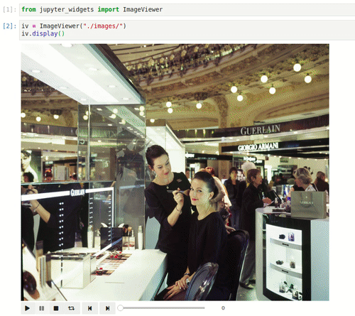

# jupyter-widgets
Jupyter Notebook widgets to make notebooks interactive

## Available widgets
- **ImageViewer** - A widget to display and navigate images from a local filesystem \
```
from jupyter-widgets import ImageViewer

iv = ImageViewer("./path/to/image/directory")
iv.display()
```

